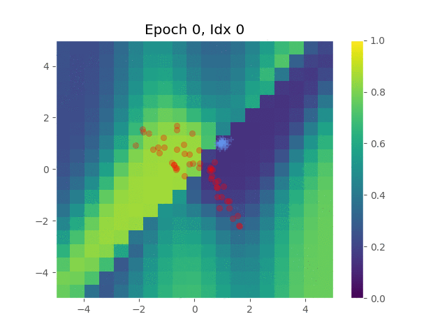

# SimpleGAN in Tensorflow

Tensorflow implementation of a simple, expository, 2-D example of [Generative Adversarial Networks](https://arxiv.org/pdf/1406.2661.pdf).

## Prerequisites

- Python 2.7 or Python 3.3+
- [Tensorflow 0.12.1](https://github.com/tensorflow/tensorflow/tree/r0.12)
- [SciPy](http://www.scipy.org/install.html)
- (optional) [Mutt email client](https://unix.stackexchange.com/questions/226936/how-to-install-setup-mutt-with-gmail-on-centos-and-ubuntu)

## Usage

To train a model on a single 2D Gaussian:

    $ python main.py

Or, you can try different settings using flags:

    $ --d_learning_rate
    $ --g_learning_rate
    $ --beta1
    $ --epoch
    $ --batch_size
    $ --z_dim
    $ --d_per_iter
    $ --g_per_iter
    $ --expt 
    $ --optim     {"adam", "adagrad"}
    $ --z_distr   {"gaussian", "uniform"}
    $ --dataset   {"gaussian", "concentriccircles"}
    $ --d_spec    {e.g. "4,4,4" for three hidden layers of 4 nodes each}
    $ --g_spec    {...see above...}

For example:

    $ python main.py --epochs=100 --expt="test" --email="me@me.com" 

To start a new run from scratch (not picking up from pre-saved checkpoints), clear previous data from an experiment named "test" using:

    $ bash clear_expt test

## Results

## Author

Maurice Diesendruck, PhD Candidate, Dept of Statistics and Data Sciences, UT Austin
Borrowed baseline code from Taehoon Kim / [@carpedm20](https://github.com/carpedm20/DCGAN-tensorflow)
